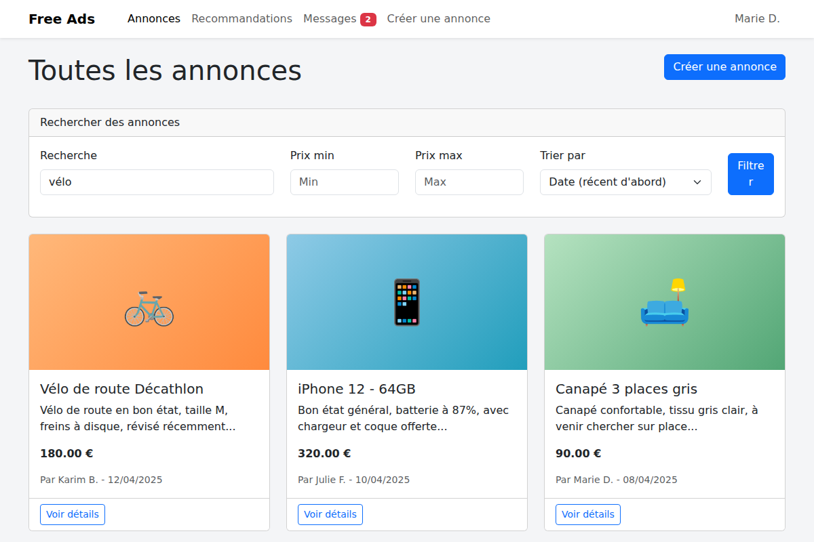

# FreeAds — Laravel Classifieds Marketplace

<p align="right"><sub>🇬🇧 English (this page) · <a href="#fr">🇫🇷 Français</a> · <a href="#es">🇪🇸 Español</a></sub></p>

*Built in early May 2025, in a 5-day solo sprint, at Epitech Web Academy.*

The exercise: build a classifieds site — think Leboncoin or Craigslist — in Laravel. Post an ad with photos, browse and filter other people's ads, message a seller, get recommendations based on what you post.



## What it does

- **Ads (`annonces`)** — full CRUD: create with a title, description, price, and multiple photos; edit or delete only your own ads
- **Browse & filter** — free-text search (title/description), min/max price, sort by date or price, paginated
- **Recommendations** — a simple content-based engine: it pulls the most frequent keywords from *your* own ads' titles/descriptions and surfaces other users' ads that share them, falling back to the most recent ads if you have none yet or aren't logged in
- **Messaging** — inbox, sent folder, and a "contact seller" link straight from an ad; unread count shown as a navbar badge
- **Auth** — registration, login, email verification, password reset (Laravel's built-in scaffolding)
- **Profile** — edit your own account details

## What's in this repo

- **[`freeads/`](freeads)** — the Laravel 12 app. Everything lives here: `app/Http/Controllers` (`AnnonceController`, `MessageController`, `ProfileController`...), `app/Models` (`Annonce`, `Photo`, `Message`, `User`), Blade views under `resources/views`, migrations under `database/migrations`.

## How to run it locally

```bash
cd freeads
composer install
cp .env.example .env
php artisan key:generate

touch database/database.sqlite     # default DB driver is sqlite
php artisan migrate

php artisan storage:link           # so uploaded ad photos are served
npm install && npm run build       # compiles resources/css and resources/js via Vite

php artisan serve
```

Then open `http://localhost:8000`. Register an account to post an ad, message a seller, or see recommendations.

## Stack

PHP 8.2+, Laravel 12, Blade, Bootstrap 5, SQLite (default) / MySQL, Vite.

---

<a id="fr"></a>
<details>
<summary>🇫🇷 Français</summary>

# FreeAds — Site de Petites Annonces en Laravel

*Réalisé début mai 2025, en 5 jours en solo, à Epitech Web Academy.*

L'exercice : construire un site de petites annonces — dans l'esprit de Leboncoin ou Craigslist — avec Laravel. Publier une annonce avec des photos, parcourir et filtrer les annonces des autres, contacter un vendeur, recevoir des recommandations basées sur ce qu'on publie soi-même.

## Ce que ça fait

- **Annonces** — CRUD complet : créer avec titre, description, prix et plusieurs photos ; modifier ou supprimer uniquement ses propres annonces
- **Parcourir et filtrer** — recherche libre (titre/description), prix min/max, tri par date ou prix, avec pagination
- **Recommandations** — un moteur simple basé sur le contenu : il extrait les mots-clés les plus fréquents de vos propres annonces et propose les annonces d'autres utilisateurs qui les partagent, avec repli sur les annonces les plus récentes si vous n'en avez pas encore ou n'êtes pas connecté
- **Messagerie** — boîte de réception, messages envoyés, et un lien "contacter le vendeur" directement depuis une annonce ; le nombre de messages non lus s'affiche en badge dans la barre de navigation
- **Authentification** — inscription, connexion, vérification d'e-mail, réinitialisation du mot de passe (le scaffolding intégré de Laravel)
- **Profil** — modifier ses propres informations de compte

## Ce que contient ce repo

- **[`freeads/`](freeads)** — l'application Laravel 12. Tout est là : `app/Http/Controllers` (`AnnonceController`, `MessageController`, `ProfileController`...), `app/Models` (`Annonce`, `Photo`, `Message`, `User`), les vues Blade dans `resources/views`, les migrations dans `database/migrations`.

## Comment le lancer en local

```bash
cd freeads
composer install
cp .env.example .env
php artisan key:generate

touch database/database.sqlite     # driver de BDD par défaut : sqlite
php artisan migrate

php artisan storage:link           # pour servir les photos d'annonces uploadées
npm install && npm run build       # compile resources/css et resources/js via Vite

php artisan serve
```

Puis ouvrez `http://localhost:8000`. Inscrivez-vous pour publier une annonce, contacter un vendeur, ou voir les recommandations.

## Stack

PHP 8.2+, Laravel 12, Blade, Bootstrap 5, SQLite (par défaut) / MySQL, Vite.

</details>

<a id="es"></a>
<details>
<summary>🇪🇸 Español</summary>

# FreeAds — Sitio de Anuncios Clasificados en Laravel

*Realizado a principios de mayo 2025, en un sprint solo de 5 días, en Epitech Web Academy.*

El ejercicio: construir un sitio de anuncios clasificados — al estilo Leboncoin o Craigslist — con Laravel. Publicar un anuncio con fotos, explorar y filtrar los anuncios de otros, contactar a un vendedor, recibir recomendaciones basadas en lo que uno mismo publica.

## Qué hace

- **Anuncios** — CRUD completo: crear con título, descripción, precio y varias fotos; editar o borrar solo tus propios anuncios
- **Explorar y filtrar** — búsqueda libre (título/descripción), precio mínimo/máximo, orden por fecha o precio, con paginación
- **Recomendaciones** — un motor simple basado en contenido: extrae las palabras clave más frecuentes de tus propios anuncios y muestra anuncios de otros usuarios que las comparten, cayendo en los anuncios más recientes si todavía no tenés anuncios propios o no iniciaste sesión
- **Mensajería** — bandeja de entrada, enviados, y un enlace "contactar al vendedor" directo desde un anuncio; los mensajes no leídos se muestran como badge en la barra de navegación
- **Autenticación** — registro, login, verificación de email, restablecimiento de contraseña (el scaffolding propio de Laravel)
- **Perfil** — editar los propios datos de la cuenta

## Qué hay en este repo

- **[`freeads/`](freeads)** — la aplicación Laravel 12. Todo está acá: `app/Http/Controllers` (`AnnonceController`, `MessageController`, `ProfileController`...), `app/Models` (`Annonce`, `Photo`, `Message`, `User`), las vistas Blade en `resources/views`, las migraciones en `database/migrations`.

## Cómo correrlo en local

```bash
cd freeads
composer install
cp .env.example .env
php artisan key:generate

touch database/database.sqlite     # el driver de BD por defecto es sqlite
php artisan migrate

php artisan storage:link           # para servir las fotos de anuncios subidas
npm install && npm run build       # compila resources/css y resources/js vía Vite

php artisan serve
```

Después abrí `http://localhost:8000`. Registrate para publicar un anuncio, contactar a un vendedor, o ver las recomendaciones.

## Stack

PHP 8.2+, Laravel 12, Blade, Bootstrap 5, SQLite (por defecto) / MySQL, Vite.

</details>
